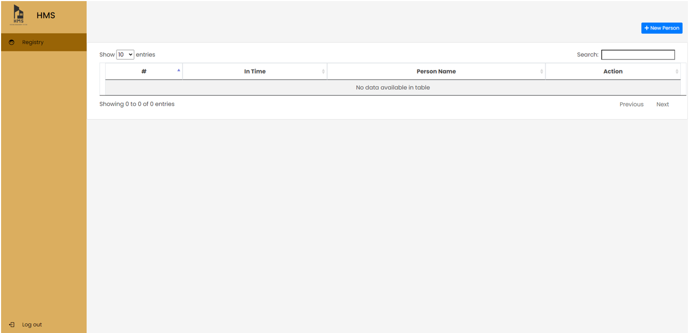

# Society Management System
Society Management System is the website portal designed to reduce conflicts among society members. The system has automated functionality for calculating monthly maintenance and member can view their bill status on their account. Login and Administration Login will separate the user, secretary and Administrator of the System. The monthly maintenance bill will be authenticated by administrator

### Built With

* HTML
* CSS
* Javascript
* Ajax
* Php
* MySQL

## Screenshots
#### Home

#### Dashboard

#### Announcement

#### Maintainence Bill

#### Events

#### MemberList

#### StaffList

#### Neighbourhood

#### Staff Page

<!-- CONTRIBUTING -->
## Contributions
- Bhavesh Ghanchi - <a>https://github.com/bhaveshGhanchi</a>
- Soham Dubewar- <a>https://github.com/sohamdubewar</a>
- Ashwin Nair - <a>https://github.com/DarkLord125</a>

Project Link: <a>https://github.com/DarkLord125/SocietyManagementSystem</a>
